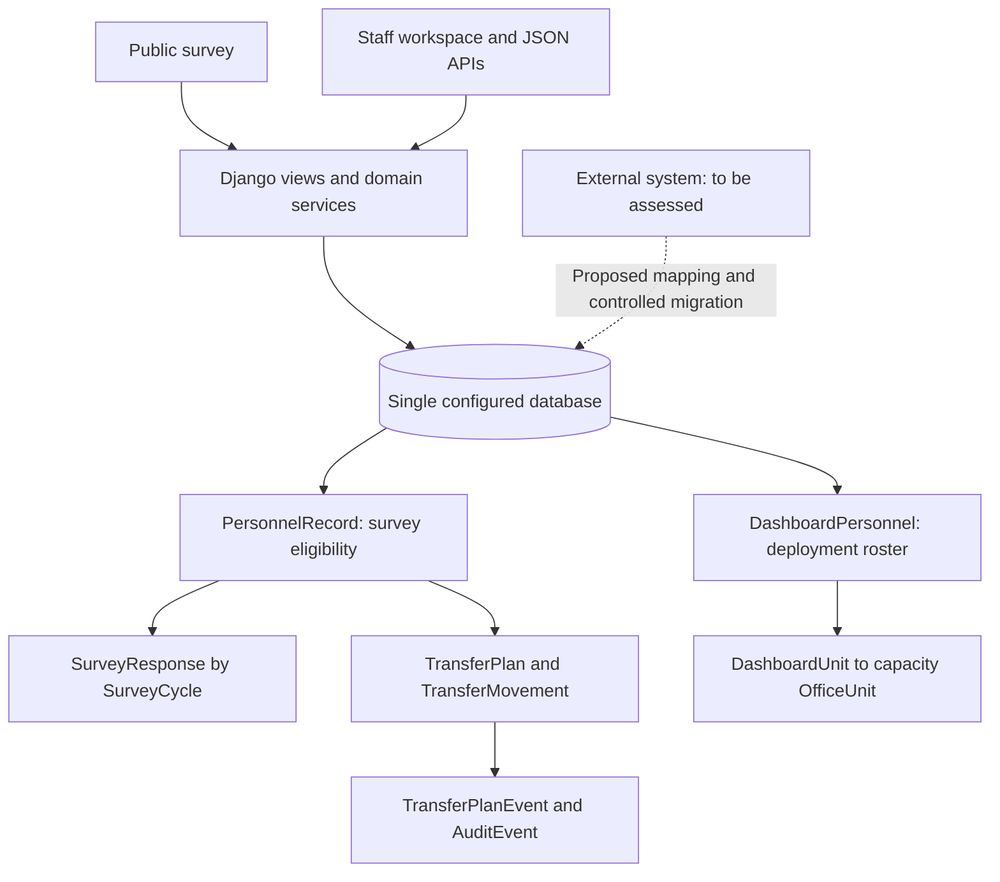

# External System and Database Integration Guide

System: **PNP Preferred Assignment Location Survey & Admin Dashboard**  
Prepared: **8 October 2026**  
Purpose: Technical handoff for combining this system's database with another system while retaining personnel identities, survey history, deployment records, and transfer audit trails.

This guide describes the repository's current implementation. The other system's source code and database have not been supplied, and no running or production database was inspected. Table names, fields, and constraints below come from Django models and migrations; deployed versions, applied migrations, data volumes, and connection details must be verified before implementation. Sections marked **Proposed** describe integration work that does not exist yet. Creating this guide does not merge or modify either database.

## 1. What this system does

The application combines these functions in one Django project and one configured database:

- A public assignment preference survey with roster verification by exact badge number, three ranked office/subunit preferences, and family/address information.
- Survey cycles, normally opened for six calendar months, with response history retained across cycles.
- A staff deployment dashboard comparing authorized staffing and actual deployment by PCO, PNCO, and NUP category.
- A complete deployment roster, separately maintained from the roster allowed to answer the survey.
- Personnel transfer planning, approval, implementation, and direct transfers with recorded reasons and history.
- Staff user management, administrator-mediated password reset requests, data imports, and CSV/XLSX exports.

PCO = Police Commissioned Officer; PNCO = Police Non-Commissioned Officer; NUP = Non-Uniformed Personnel. These category values are used by import validation and staffing calculations.

The existing survey and admin workspace already share a database. The integration described here concerns an additional external system.

## 2. Current technology stack

| Layer | Current implementation | Integration implication |
|---|---|---|
| Application language | Python; an exact interpreter version is not pinned in the inspected dependency/deployment files | Record the actual deployed Python version and align runtimes before combining application code |
| Web framework | Django `>=5.2.17,<5.3` | Django ORM, migrations, templates, authentication, permissions, and sessions own the application schema |
| Production database | PostgreSQL required by production settings | A combined database must remain compatible with PostgreSQL constraints, JSONB, transactions, and row locking |
| Local database | PostgreSQL; SQLite fallback only with debug enabled and no PostgreSQL configuration | Validate migration and concurrency on PostgreSQL rather than relying solely on SQLite |
| Local PostgreSQL container | `compose.yaml`: `postgres:17-alpine` | This is a development image declaration, not verification of the production server version |
| Frontend | Django server-rendered HTML, local CSS, vanilla JavaScript | No React/Next.js frontend or Node build is required for the current production path |
| HTTP interface | Django views returning JSON, plus browser form endpoints | No Django REST Framework dependency; clients must use the actual view contracts |
| Authentication | Django `auth.User`, session cookies, staff/superuser flags, model permissions | Personnel records are separate from login accounts; shared personnel does not automatically mean shared login |
| Database driver/configuration | `psycopg[binary]`, `dj-database-url`, `python-dotenv` | Database connection comes from environment configuration |
| Spreadsheet I/O | `openpyxl` | Existing importers require specific workbook layouts |
| Static assets | WhiteNoise; compressed manifest storage in production | Collect static files during deployment |
| Web serving | Gunicorn on Railway; Waitress is also a dependency | Current Railway command runs two workers, with a 120-second timeout |
| Production rate-limit cache | Django `DatabaseCache`, table `django_cache` | The combined database also carries operational cache storage |
| Tests | Django test suite and Node built-in JavaScript tests | Node is used for frontend checks, not a required production frontend build |
| Time handling | `TIME_ZONE = Asia/Manila`, `USE_TZ = True` | Keep timezone-aware timestamps and distinguish date-only fields from instants |

Dependencies declared in [requirements.txt](../requirements.txt):

```text
Django>=5.2.17,<5.3
dj-database-url>=2.3,<4
openpyxl>=3.1,<4
psycopg[binary]>=3.2,<4
whitenoise>=6.9,<7
waitress>=3.0,<4
gunicorn>=23,<24
python-dotenv>=1.1,<2
```

These are allowed version ranges, not a lockfile or an inventory of installed production packages. The older `docker-compose.yml` declares PostgreSQL 16, while `scripts/dev.ps1` explicitly uses `compose.yaml` and PostgreSQL 17. Select the intended configuration explicitly. The launcher uses local port 5433 by default; `.env.example` contains a port-5432 example. Do not infer production host, port, or credentials from these examples.

## 3. Architecture and data relationships



The application uses only Django's `default` database connection. There is no configured multi-database router, external database connector, replication process, or synchronization worker. Assignments in `PersonnelRecord` are stored as text fields, not a foreign key to `OfficeUnit`. Preferences and transfer destinations use office foreign keys. Integration must reconcile those two representations.

### Application table inventory

All 17 application models currently use Django's default `survey_` table prefix. Each has an implicit `id` BigAutoField primary key. Appendix A provides every local model column, type, nullability, default, and foreign-key target.

| Model / SQL table | Purpose and important relationships |
|---|---|
| `PersonnelRecord` / `survey_personnelrecord` | Survey-eligible personnel; unique `badge_number`; textual current assignment and designation date |
| `DashboardPersonnel` / `survey_dashboardpersonnel` | Complete deployment roster; unique `identity_key`; required dashboard unit/import batch; optional one-to-one link to survey personnel |
| `OfficeUnit` / `survey_officeunit` | Canonical office reference; unique `code`; section, active/selectable flags, grouping, ordering |
| `DashboardUnit` / `survey_dashboardunit` | Stable dashboard count row; unique `key`; optional capacity mapping to `OfficeUnit` |
| `DashboardMappingOverride` / `survey_dashboardmappingoverride` | Reviewed identity-to-dashboard-unit override with reason and optional actor |
| `DashboardRosterImport` / `survey_dashboardrosterimport` | Roster import provenance, SHA-256, counts, optional as-of date and importer |
| `SurveyCycle` / `survey_surveycycle` | Survey window, status, privacy notice/version, occupation label |
| `SurveyResponse` / `survey_surveyresponse` | Personnel + cycle response, preference FKs/details, family/address data, receipt and timestamps |
| `DeploymentSnapshot` / `survey_deploymentsnapshot` | Dated deployment source, source totals/variances, current flag |
| `AuthorizedStrength` / `survey_authorizedstrength` | Authorized PCO/PNCO/NUP counts per snapshot and office |
| `ActualDeployment` / `survey_actualdeployment` | Actual staffing source rows; optional office mapping; reported-count flag and source provenance |
| `DataQualityIssue` / `survey_dataqualityissue` | Snapshot import warning/error, source row, resolution flag |
| `TransferPlan` / `survey_transferplan` | Status/effective date/reason, optional source snapshot, creating/submitting/reviewing/implementing users |
| `TransferMovement` / `survey_transfermovement` | One or two personnel movements per plan; destination office, optional dashboard links, new assignment, original assignment JSON |
| `TransferPlanEvent` / `survey_transferplanevent` | Plan status/action history, optional actor, note/detail JSON |
| `AuditEvent` / `survey_auditevent` | General action audit trail, optional actor, JSON detail and creation time |
| `PasswordResetRequest` / `survey_passwordresetrequest` | Staff-account reset approval workflow; user, reviewer, tokens and status |

### Framework and operational tables

The default Django applications also manage `auth_user`, `auth_group`, `auth_permission`, `auth_user_groups`, `auth_user_user_permissions`, `auth_group_permissions`, `django_content_type`, `django_admin_log`, `django_session`, and `django_migrations`. Production cache storage adds `django_cache` through `createcachetable`.

Do not blindly merge authentication, content-type, permission, or migration tables from another Django application. App labels and migration names may collide; numeric permission/content-type/user IDs may mean different things. If keeping two independent Django services in one PostgreSQL database, design schema isolation and ownership first; separate PostgreSQL schemas/search paths are a **proposed configuration change**, not a current feature. If combining them into one Django project, reconcile installed apps, app labels, migration dependencies, and account ownership deliberately.

## 4. Identity matching and field mapping

### Rules that affect a database merge

1. **Survey personnel and dashboard personnel have different scopes.** Importing the complete deployment roster does not grant survey eligibility. Keep the nullable `DashboardPersonnel.survey_personnel` relationship and the explicit eligibility decision.
2. **Badge numbers are strings.** Preserve leading zeros, separators, and length (maximum 40 characters). Public verification performs an exact badge lookup; normalization must not silently change what existing users enter.
3. **Dashboard identifiers differ by category.** The current importer creates PCO/PNCO identities as `<CATEGORY>:BADGE:<normalized badge>` and NUP identities as `NUP:NAME:<normalized full name>`. Normalization uppercases and removes non-alphanumeric characters. NUP `badge_or_grade` cells may hold repeated salary grades, so they are not a unique employee identifier. Name-based NUP identities need manual conflict review, particularly for same-name personnel or name changes.
4. **IDs are local to each database.** An external employee ID equal to this system's personnel PK does not prove they are the same person. Retain this system's IDs where possible and map external IDs through a reviewed crosswalk.
5. **Source row/number fields are provenance, not universal identity.** They can differ between workbooks and imports.
6. **Office aliases require explicit mapping.** Examples handled in code include `ITMS`/`ITMS HO`/`ITMS HQ`, regional formatting variants, and Crame office aliases. A selectable parent office may correspond to several dashboard/capacity units.
7. **Audit JSON contains identifiers as well as foreign keys.** Preserve original evidence with its originating system; record old-to-new ID translations separately. If history is rekeyed, inspect JSON references and embedded assignment snapshots in addition to SQL FKs.

### Suggested mapping worksheet for the other team

| This system's field | Meaning / requirement | Other-system mapping to supply |
|---|---|---|
| `PersonnelRecord.id` | Internal bigint PK | Local-to-canonical ID crosswalk; never match only on equal numeric IDs |
| `badge_number` | Unique string, max 40; survey verification identifier | Employee/badge identifier, formatting, uniqueness scope, reuse policy |
| `full_name` | String, max 220 | Name fields and agreed display-name construction |
| `rank_category` | Import values `PCO`, `PNCO`, `NUP` | Category/code lookup |
| `rank` | String, max 80 | Rank code/name lookup |
| `birthdate` | Non-null date | Birth date source and policy for missing values; do not invent dates |
| `effective_designation_date` | Nullable date; basis for calculated tenure | Assignment effective date, distinct from hire date |
| `designation` | String, max 220 | Current designation/position |
| `sub_section` | String, max 180; blank allowed | Subsection |
| `division` | String, max 180 | Division |
| `pnp_office_unit` | String, max 220; current assignment text | Unit/office plus canonical office mapping |
| `area_location` | String, max 220 | Assignment area/location |
| `active` | Eligibility roster lifecycle flag | Active status and separate survey-eligibility rule |
| `source_number`, `source_row` | Non-null integer provenance fields | Reviewed provenance values for records not sourced from Excel |
| `OfficeUnit.code` | Unique string, max 80 | Office key and alias crosswalk |
| `DashboardPersonnel.identity_key` | Unique string, max 260; importer-derived | Stable external personnel ID crosswalk, including NUP disambiguation |
| `DashboardUnit.key` | Unique string, max 320; count-row identity | Section/group/unit mapping to staffing and capacity rows |
| `SurveyResponse.cycle_id` | Nullable legacy cycle FK; normally required by submission workflow | Survey period mapping; historical null-cycle policy |
| `SurveyResponse.reference` | Unique nullable receipt string, max 30 | Preserve existing receipts; resolve collisions explicitly |
| `SurveyResponse.submitted_at` | Original submission timestamp | Preserve timezone and meaning |
| `last_edited_submission_at` | Most recent edited submission timestamp | Separate from original submission and general row update time |

**Proposed crosswalk design:** retain a canonical person ID and a unique `(source_system, source_person_id)` mapping, with this system's personnel/dashboard IDs, match method, review status, batch, and reviewer. Create equivalent office and user mappings. Define these tables through new migrations or an integration staging schema; no such external-ID mapping exists today.

Resolve ambiguous matches before inserting domain records. Do not automatically merge people using names alone. Preserve separate originals and produce a conflict report when badges, names, birth dates, categories, or assignments disagree.

## 5. Constraints and business behavior to preserve

### Database constraints

- Only one `DeploymentSnapshot` may have `is_current=True`.
- Only one `DashboardRosterImport` may have `is_current=True`.
- Only one `SurveyCycle` may have status `open`; `closes_at >= opens_at`.
- `SurveyResponse` is unique on `(cycle, personnel)`. Because `cycle` is nullable, PostgreSQL's ordinary uniqueness semantics do not prevent multiple null-cycle legacy responses for one person. Review these explicitly.
- `SurveyResponse.reference`, office codes, badge numbers, dashboard identity keys, unit keys, and override identity keys have uniqueness requirements.
- `AuthorizedStrength` is unique on `(snapshot, office)`; `ActualDeployment` is unique on `(snapshot, source_row)`. Nullable actual source rows require separate duplicate checks.
- `TransferMovement` is unique on `(plan, sequence)` and `(plan, personnel)`; sequence must be 1 or 2.
- `DashboardPersonnel.survey_personnel` is nullable but one-to-one when set.

Foreign-key deletion behavior matters: survey personnel/cycles/preference offices and most transfer references use `PROTECT`; snapshot child rows and plan child rows use `CASCADE`; selected optional actors/mappings use `SET_NULL`. Appendix A lists the exact relationship behavior. Disabling constraints or deleting parent rows to force a merge can lose history.

### Application rules beyond SQL constraints

- Survey submission requires an active eligible record, a currently accepting cycle, and a matching server-side verification session. Verification lasts 15 minutes and is rate-limited.
- Preference validation includes current-assignment exclusion and office/subunit rules. Crame and NCRPO choices may repeat a parent office only under the distinct subunit rules. Preserve `first_office_detail`, `second_office_detail`, and `third_office_detail`; parent office IDs alone are insufficient.
- Exact submission retries return the original receipt. Changed ordinary retries are rejected. A verified self-service edit context and administrator reopening are supported controlled correction paths; edits preserve original `submitted_at` and record `last_edited_submission_at`.
- Starting a new cycle closes the current one and retains previous responses. Cycle selection defaults to the open/newest cycle in staff listings; export each cycle deliberately when extracting history.
- Tenure is calculated from the designation effective date and an as-of date. It is not a stored source-of-truth field.
- Transfer statuses are `draft`, `pending`, `approved`, `rejected`, `cancelled`, and `implemented`. The reviewed path is draft -> pending -> approved -> implemented; cancellation/rejection are controlled alternatives. A direct transfer also exists as an immediate domain operation.
- Transfers validate assignments/capacity and use transactions and row locks. Approved-plan implementation checks the effective date and the original assignment before changing personnel. Roster mode updates the linked dashboard assignment too. Direct-transfer capacity confirmations have their own rules.
- In roster mode, actual counts come from active `DashboardPersonnel` rows by dashboard unit/category. Do not count those rows and also apply transfer deltas for the same movement. Legacy snapshot count mode has different calculations; preserve the deployment flag and mappings.
- Model field choices are not automatically SQL CHECK constraints. Raw SQL must not be treated as equivalent to Django form/service validation, timestamp updates, audit creation, or permission checks.

Use [survey/transfer_workflow.py](../survey/transfer_workflow.py), [survey/transfer_services.py](../survey/transfer_services.py), [survey/cycle_services.py](../survey/cycle_services.py), and [survey/views.py](../survey/views.py) as the behavior sources when adding integrations.

## 6. Authentication, permissions, and existing interfaces

Current interfaces are designed for same-origin browser sessions. There is no configured bearer-token/JWT API, OAuth/OIDC SSO, CORS middleware, service-account token mechanism, webhook feed, or general external personnel CRUD/sync API.

The supported session sequence is:

1. `GET /api/session/` obtains session state and `csrf_token` and ensures a CSRF cookie.
2. `POST /api/auth/login/` sends a JSON username/password with cookies and `X-CSRFToken`.
3. Refresh session/CSRF state after login because Django rotates authentication-related state. Send session cookies and a current CSRF token for mutations.
4. Use staff endpoints with an active authenticated `is_staff` account and any additional required permissions.
5. `POST /api/auth/logout/` closes the session.

Production session/CSRF cookies are secure; sessions last up to one hour and expire at browser close. `SameSite=Lax` and same-origin CSRF checks affect cross-site use. Adding `CSRF_TRUSTED_ORIGINS` alone does not create a cross-origin integration or SSO solution. **Proposed:** implement narrowly scoped server-to-server authentication and endpoints if ongoing machine synchronization is required, instead of coupling an external service to a human administrator session.

### Endpoint inventory relevant to integration

| Method and route | Purpose / access |
|---|---|
| `GET /api/session/` | Authentication state and CSRF token |
| `POST /api/auth/login/`, `/api/auth/logout/` | Staff session login/logout; CSRF required |
| `POST /api/personnel/verify/`, `/api/personnel/verify/clear/` | Public survey badge verification/clear; CSRF required |
| `GET /api/personnel/search/` | Retired endpoint; `410 Gone`, not a roster extraction interface |
| `GET /api/offices/` | Public selectable office list |
| `GET /api/camp-crame-units/`, `/api/ncrpo-units/` | Public subunit choices maintained in code |
| `GET /api/survey/cycle/` | Open survey cycle metadata |
| `POST /api/survey/submit/` | Validated survey submission using verified session |
| `POST /api/survey/edit/`, `/api/survey/edit/save/` | Verified self-service edit context/autosave |
| `GET /api/admin/overview/` | Staff deployment metrics/rows |
| `GET /api/dashboard/personnel/` | Staff dashboard personnel listing |
| `GET /api/admin/survey-responses/` | Staff filtered response listing; supports `cycle`, `page`, `page_size` |
| `GET /api/admin/survey-responses/<personnel_id>/` | Staff response detail; numeric personnel PK and optional `cycle` |
| `GET /api/admin/transfer-planning/`, `/api/admin/transfer-reference/` | Staff transfer candidates/reference data |
| `GET, POST /api/admin/transfer-plans/` | Staff list/create plans; creation accepts one or two movements |
| `GET /api/admin/transfer-plans/<plan_id>/` | Staff plan detail |
| `PATCH /api/admin/transfer-plans/<plan_id>/edit/` | Edit a draft; creator or `survey.change_transferplan`; optional `updated_at` stale-change guard |
| `POST /api/admin/transfer-plans/<plan_id>/submit/` | Submit draft; creator or change permission |
| `POST /api/admin/transfer-plans/<plan_id>/approve/`, `/reject/` | Require `survey.approve_transferplan` |
| `POST /api/admin/transfer-plans/<plan_id>/implement/` | Require `survey.implement_transferplan` |
| `POST /api/admin/transfer-plans/<plan_id>/cancel/` | Status-dependent creator/change/reviewer permission |
| `GET, POST /api/admin/offices/` | Staff reference listing / legacy management interface |
| `POST /api/admin/offices/new/`, `PATCH /api/admin/offices/<office_id>/` | Staff create/update offices |
| `POST /api/admin/personnel-imports/` | Staff plus add/change personnel permissions; workbook preview/commit |
| `POST /api/admin/dashboard-roster-imports/` | Superuser; complete roster preview then same-file commit |
| `POST /api/admin/deployment-imports/` | Staff; deployment Markdown/text import; blocked if dashboard roster mode is enabled or a current roster is installed |
| `GET /api/admin/deployment-export/` | Staff deployment CSV |
| `GET /api/health/live/`, `/api/health/ready/` | Public deployment health probes |

Additional protected browser routes include `/survey-responses/export/`, `/survey-responses/export.xlsx`, `/dashboard/export/`, `/dashboard/export.xlsx`, `/survey-cycles/start-next/`, `/survey-responses/<personnel_id>/reopen/`, `/dashboard/deployment-counts/`, and `/transfer-personnel/`. Browser mutation routes use form contracts and CSRF; do not assume they accept JSON.

**Identifier distinction:** the public verification/submission JSON key `personnel_id` contains a **badge string**. Staff response-detail URLs and transfer movement payloads use the **numeric PersonnelRecord primary key**. Resolve IDs through the mapping before constructing requests.

For example, this is a synthetic public verification payload:

```json
{"personnel_id": "TEST-SURVEY-001"}
```

Staff response-list pagination defaults to 50 records and allows up to 100 per page. Its envelope includes `results`, `pagination`, `summary`, filter metadata, and selected cycle. Some public endpoints return arrays or `{ "error": "message" }`; admin helpers return `{ "error": { "code": "...", "message": "..." } }`. CSRF and decorator failures can have different response formats. Handle status codes and validate response content types rather than assuming one global envelope. There is no API version prefix or generated OpenAPI schema in the inspected project.

Routes and implementation are authoritative: [survey/api/urls.py](../survey/api/urls.py), [survey/urls.py](../survey/urls.py), [survey/api/serializers.py](../survey/api/serializers.py), and [survey/api/responses.py](../survey/api/responses.py). [API_CONTRACT.md](API_CONTRACT.md) supplies examples but does not describe every current edit/subunit behavior.

## 7. Existing imports and exports

Existing imports are useful adapters for validated roster data, but they do not migrate the entire application history or an arbitrary database dump.

| Import | Current contract | Merge implication |
|---|---|---|
| Survey-eligible personnel | `.xlsx`, `FOR SURVEY` worksheet, data from row 10; API file field `source`, `mode=preview` or `commit`, `keep_missing`; 5 MB view limit | Upserts by exact badge, updates assignment fields, marks imported records active; by default deactivates eligible personnel absent from the workbook |
| Complete dashboard roster | `.xlsx`, `FOR SURVEY`, row 10 onward; API `source`, preview/commit; 10 MB view limit; `expected_total` defaults to 600 | Maps category/identity/unit, records SHA-256 and batch; API commit requires the exact file previewed in the same session; does not grant eligibility |
| Deployment source | UTF-8 `.md`/`.txt`; API `source`; 2 MB view limit | Imports staffing snapshot/provenance; unavailable while roster mode is enabled or a current roster is installed |

**The two personnel workbook layouts differ.** Both use A-E for source number, category, rank, badge/grade, and name. The eligible-personnel importer uses F=birthdate, G=designation date, H=designation, I=subsection, J=division, K=office/unit, L=area/location. The complete-dashboard importer uses G=designation date, H=designation, **K=division and L=office/unit**; F is not imported as a dashboard birthdate. Produce separate reviewed files/adapters rather than submitting one transformed workbook to both importers without checking columns.

Eligible-roster preview reports created/updated/would-deactivate counts and validation errors. Unlike the dashboard API, it does not require a previous same-file preview before commit. For partial integration feeds, explicitly use `keep_missing=true`; otherwise absent records are deactivated. Reimporting old eligible-roster assignment values can overwrite a newer assignment, so settle assignment ownership first.

The dashboard importer rejects unresolved mappings and protects changed assignments/removals by default. The CLI has explicit `--replace-assignments` and `--allow-removals` options; these are not generic API JSON flags. Its expected total of 600 is a configurable import validation default, not a confirmed count of the current live database. Even dashboard preview calls synchronize dashboard unit records, so treat it as an operation against a staging database during rehearsals.

Available commands include:

```text
python manage.py load_personnel_roster <eligible-roster.xlsx> --keep-missing
python manage.py load_dashboard_roster <deployment-roster.xlsx> --expected-total <reviewed-total>
python manage.py load_dashboard_roster <deployment-roster.xlsx> --expected-total <reviewed-total> --commit
```

The first command commits immediately; dashboard loading defaults to preview. These examples are for an isolated integration environment after reviewing the source and mapping. Exports are reporting artifacts, not full database backups: they may omit accounts, constraints, complete audit history, import batches, and historical cycles. Use a consistent PostgreSQL backup/extraction for full migration.

## 8. Recommended combined-database design — Proposed

Use a single target PostgreSQL database, retain this application's existing domain tables initially, and merge overlapping personnel/office identities through explicit mappings. Import the external system's domain-specific tables into an isolated staging area, reconcile them, then promote reviewed records. This approach limits changes to existing survey/transfer foreign keys while giving both systems a canonical identity.

Agree on whether the final deployment is one application or two services sharing that database. A shared database alone does not combine screens, login, permissions, workflows, or ownership.

| Domain | Current owner | Proposed integration decision |
|---|---|---|
| Canonical identity, name, rank, birthdate | `PersonnelRecord` for eligible roster; `DashboardPersonnel` for full roster | Select an authoritative personnel registry; preserve source crosswalks and explicit eligibility |
| Current assignment and effective date | Roster imports and transfer domain services | Select one assignment writer or route both systems' changes through a common validated service |
| Office/unit vocabulary | `OfficeUnit`, dashboard mappings, code-defined survey subunits | Approve a canonical office dictionary and mapping for parent/subunit/capacity distinctions |
| Survey cycles and answers | This system | Retain ownership, cycle history, receipt references, correction context, and original timestamps |
| Staffing authorization/counts | Snapshots and dashboard roster mode | Choose one actual-count basis and preserve authorized-strength provenance |
| Transfer approvals/implementation | This system's workflow | Map external transfers to reviewed domain operations; prevent duplicate implementation |
| Login accounts and permissions | Django auth | Choose local auth or a separately implemented SSO migration; review user mapping independently |
| Audits/import provenance | Both systems | Retain origin, actor mapping, batch/checksum, and original evidence |

If the external database is MySQL, SQL Server, SQLite, or another engine, transform its data into the target PostgreSQL schema. Setting this project's production database URL to that engine is not a supported combination strategy. A proposed fully unified schema needs model changes, migrations, service changes, and contract tests; merely renaming imported tables is insufficient.

For two services sharing PostgreSQL, use separate restricted database roles and explicit table/schema ownership. Do not allow the external service to bypass transfer or survey rules with direct domain-table writes. A migration role can have broader temporary privileges; application roles should have only the access their agreed responsibilities require.

## 9. Migration and cutover plan — Proposed

1. **Inventory both systems.** Record deployed revisions, DB engine/version, schema definitions, applied migrations, row counts, constraints/indexes, timezone/collation, identity formats, data owners, maintenance window, and rollback requirements. Use redacted samples; connection secrets belong in a secret manager, not this document.
2. **Back up and rehearse restoration.** Take consistent backups of both databases and verify restoration into isolated PostgreSQL environments. Capture the same logical point in time or record the extraction cutoff/change backlog.
3. **Prepare the target schema.** Prefer restoring this system's database with its migration history as the baseline, then applying reviewed new integration migrations. For a fresh schema, review existing data migrations before loading records. Do not import a different service's `django_migrations` rows or fake migration state to hide incompatible tables.
4. **Stage the external data.** Keep original source IDs, extraction time, batch/checksum, and raw values. Staging tables and crosswalks are new integration artifacts; no domain write should happen before validation.
5. **Resolve conflicts.** Review duplicate/missing/reused badges, NUP name collisions, office aliases, users, receipt conflicts, null-cycle records, invalid dates, overlength fields, missing birthdates, and assignment disagreements. Reject or quarantine unresolved records rather than fabricating required values.
6. **Load in dependency order.** Reconcile accounts needed by actor FKs and office references; retain/load snapshots and cycles; load authorized/actual rows and dashboard units; load eligible personnel and dashboard import batches; load dashboard personnel/overrides; then load responses, plans, movements, events, issues, and audits with remapped relationships. One-to-one links and protected references must remain valid.
7. **Preserve data semantics.** Keep history, original references, null-vs-blank distinctions, JSON arrays/objects, original and edit timestamps, source provenance, active flags, and reviewed workflow states. Do not run transfer implementation simply to copy an already implemented historical transfer; that would apply it again.
8. **Handle IDs and sequences.** Keep existing survey-system PKs where practical; assign collision-free new IDs and store crosswalks for imported records. Reset PostgreSQL identity/sequence positions after explicit-PK loads so future inserts cannot collide. Review JSON identifier references separately. Use atomic writes for related changes and a resumable batch strategy for large loads.
9. **Validate and reconcile.** Run the checks in Section 11 on staging; review counts, assignments, mappings, permissions, workflows, exports, and data-quality conflicts. Produce a signed-off reconciliation report with unresolved items clearly identified.
10. **Cut over with a write boundary.** Pause both systems' writes for a scheduled window or implement a reviewed final-delta process. Load changes since the extraction cutoff, reconcile again, change configuration, deploy compatible application versions, and run smoke checks before reopening writes.
11. **Keep rollback executable.** Retain original databases/backups and prior application/configuration versions. If new target writes have occurred, reconcile or replay them before reverting; restoring an old backup alone would lose those writes. Agree on the acceptable data-loss window and restoration time with the owners.

The repository contains data normalization, timestamp repair, transfer cleanup, and assignment correction migrations, not just schema creation. The current migration leaf is `0034_correct_dashboard_assignment`, which can use the temporary `PERSONNEL_ASSIGNMENT_CORRECTION` payload variable. Inspect the migration graph and deployed state before running migrations against combined data; do not carry one-off correction variables into a new integration deployment casually.

### Ongoing updates after the merge — Proposed

If both services remain active, define one owner per field/domain and use a controlled API or integration worker for changes. A durable outbox/change log, unique source event ID, retry policy, reconciliation job, and recorded integration actor/batch can prevent missed updates and duplicate transfers. These facilities need implementation; existing `updated_at` fields do not provide a complete change feed, deletion feed, or reliable event ordering across both systems. Resolve simultaneous assignment changes using business rules rather than automatically trusting the last timestamp.

## 10. Configuration and deployment handoff

| Configuration | Required integration information |
|---|---|
| `DATABASE_URL` | Target PostgreSQL host/port/database, application role, connectivity and TLS requirements; distribute credentials separately |
| `DB_ENGINE`, `DB_NAME`, `DB_USER`, `DB_PASSWORD`, `DB_HOST`, `DB_PORT` | Alternative PostgreSQL settings when `DATABASE_URL` is empty; production accepts the explicit PostgreSQL engine configuration too |
| `DJANGO_SECRET_KEY` | Keep the existing application's secret securely or plan session/reset invalidation when rotating it |
| `DJANGO_DEBUG` | `0` for production |
| `DJANGO_ALLOWED_HOSTS` | Actual service domains/hosts after integration |
| `CSRF_TRUSTED_ORIGINS` | Authorized HTTPS browser origins for the chosen deployment |
| `RAILWAY_PUBLIC_DOMAIN` | Railway host if applicable; automatically added to host/origin configuration |
| `DASHBOARD_ROSTER_ENABLED` | `true` or `false` according to the reconciled count mode; import/map roster before enabling it |
| `DEMO_MODE` | Keep demo seeding disabled in production; it is gated by debug mode |
| `DATABASE_PATH` | Local SQLite fallback only; not a production integration target |

The current Railway deployment in [railway.toml](../railway.toml) performs:

```text
Build:      python manage.py collectstatic --noinput
Predeploy:  python manage.py migrate --noinput
            python manage.py sync_survey_offices
            python manage.py createcachetable --database default
Start:      gunicorn config.wsgi:application --bind 0.0.0.0:$PORT --workers 2 --timeout 120
Readiness:  /api/health/ready/
```

Review automatic office synchronization with the canonical office dictionary before cutover. Cache/session storage is operational state; rebuilding cache and invalidating sessions may be appropriate during migration. Password-reset tokens and claim tokens must not be copied into public handoff files. If migrating accounts, handle Django password hashes through a reviewed compatible authentication process; plain-text passwords are neither stored nor required for the personnel merge.

Family details, birthdates, addresses, reset tokens, and audit JSON can contain sensitive data. Limit transfer files and access to the integration team, use synthetic/redacted fixtures for rehearsals where possible, and agree on access/retention requirements with the system owner. This repository does not establish the other system's data-sharing authorization or policy.

## 11. Validation and acceptance checklist — Proposed

- [ ] Every imported source identity has a reviewed canonical mapping or an explicit quarantine decision.
- [ ] No unexpected duplicate badges, receipt references, dashboard identities, or one-to-one links; no orphaned foreign keys.
- [ ] Counts reconcile per source, active/eligible population, cycle/status, office, snapshot, and PCO/PNCO/NUP category. Ineligible dashboard-only personnel remain ineligible.
- [ ] There is at most one current deployment snapshot, one current roster batch, and one open cycle; null-cycle legacy rows are reviewed separately.
- [ ] Original survey receipts, submission/edit timestamps, family/address values, all three office details, and prior-cycle responses match the baseline.
- [ ] Assignment effective dates, canonical office aliases, dashboard mappings, authorized capacity, and active flags reconcile; counts do not double-apply transfers.
- [ ] User/actor mappings, permissions, audit history, transfer original-assignment JSON, and import provenance are intact.
- [ ] Health/readiness, staff login, unauthenticated rejection, unauthorized-operation rejection, and CSRF enforcement work on the final domains.
- [ ] With synthetic staging personnel, test verification -> survey submission -> exact retry -> controlled edit -> staff review -> transfer -> dashboard reconciliation; also test a new cycle without losing history.
- [ ] Test concurrent conflicting updates, repeated migration batches/events, stale assignments, missing required fields, and partial-import deactivation behavior.
- [ ] CSV/XLSX output, historical cycle selection, backup restore, and rollback have been checked; both system owners approve the reconciliation report.

Read-only PostgreSQL checks to adapt for a staging rehearsal:

```sql
-- Row counts are evidence, not a complete correctness check.
SELECT rank_category, active, COUNT(*)
FROM survey_personnelrecord GROUP BY rank_category, active;

SELECT rank_category, active, COUNT(*)
FROM survey_dashboardpersonnel GROUP BY rank_category, active;

SELECT cycle_id, status, COUNT(*)
FROM survey_surveyresponse GROUP BY cycle_id, status;

-- Null-cycle legacy rows need explicit review despite the ordinary unique constraint.
SELECT personnel_id, COUNT(*)
FROM survey_surveyresponse WHERE cycle_id IS NULL
GROUP BY personnel_id HAVING COUNT(*) > 1;

SELECT COUNT(*) AS eligible_without_dashboard_link
FROM survey_personnelrecord p
LEFT JOIN survey_dashboardpersonnel d ON d.survey_personnel_id = p.id
WHERE p.active AND d.id IS NULL;

SELECT dashboard_unit_id, rank_category, COUNT(*)
FROM survey_dashboardpersonnel WHERE active
GROUP BY dashboard_unit_id, rank_category;
```

An eligible record without a dashboard link is a reconciliation finding; its acceptability depends on count mode and workflow, so it is not automatically a database integrity error. Execute verification queries only in the agreed environment; they were not run while preparing this guide.

Project checks after implementation, against an isolated test configuration:

```text
python manage.py check
python manage.py makemigrations --check --dry-run
python manage.py showmigrations --plan
python manage.py test
node --check static/survey.js
node --test tests/survey-rules.test.cjs tests/personnel-search.test.cjs tests/custom-select.test.cjs tests/consent-flow.test.cjs
```

## 12. Information required from the other system

Provide this checklist to the other development team before finalizing mapping or running a merge. Do not include passwords, production connection strings, tokens, or unredacted personnel extracts in this Markdown file.

| Required item | What to provide | Status |
|---|---|---|
| System identity | Name, purpose, owner, source repository/revision, technical contact | Not supplied |
| Application stack | Language/runtime versions, framework, frontend, hosting/deployment method | Not supplied |
| Database platform | Engine/version, schemas, extensions, collation/timezone, approximate size/row counts | Not supplied |
| Schema | DDL/ERD, field dictionary, PKs/FKs, constraints, indexes, migration history | Not supplied |
| Personnel identity | Unique IDs, badge format/reuse rules, NUP identifiers, duplicate examples with redacted values | Not supplied |
| Organization reference | Office/unit hierarchy, code lists, aliases, rank/category values | Not supplied |
| Overlapping domains | Personnel, assignments, survey, deployment, transfers, auth, history; authoritative owner per field | Not supplied |
| Data scope | Full consolidation or selected tables; history/attachments/inactive records to retain | Not supplied |
| Interface contracts | API routes/auth, pagination, rate limits, event/change feeds, import/export formats | Not supplied |
| Accounts and permissions | User ID mapping, SSO requirements, roles, approval rules, password-hash compatibility | Not supplied |
| Final architecture | One application or two services; target database and schema ownership | Not supplied |
| Operations | Network access/TLS, backups, allowed downtime, backup retention, recovery targets, final-delta approach | Not supplied |
| Governance and review | Data-sharing scope, access/retention rules, conflict reviewers, acceptance owners | Not supplied |

Deliverables for implementation: approved mapping workbook, conflict report, schema/integration migrations, repeatable staging loader, reconciliation report, deployment configuration, cutover/rollback runbook, and any ongoing synchronization contract.

## 13. Source references

- [Models and relationships](../survey/models.py) and [migration history](../survey/migrations/).
- [Database/security settings](../config/settings.py), [root URLs](../config/urls.py), [API URLs](../survey/api/urls.py), and [browser/public survey URLs](../survey/urls.py).
- [Personnel import behavior](../survey/personnel_import_service.py), [dashboard roster mapping/import](../survey/dashboard_roster.py), [staff import endpoints](../survey/api/imports.py), and [deployment source services](../survey/services.py).
- [Transfer workflow](../survey/transfer_workflow.py), [capacity calculations](../survey/transfer_services.py), [survey cycle operations](../survey/cycle_services.py), and [public survey/correction views](../survey/views.py).
- [API response serializers](../survey/api/serializers.py), [API contract examples](API_CONTRACT.md), [dashboard roster rollout](DASHBOARD_ROSTER_ROLLOUT.md), and [local PostgreSQL setup](LOCAL_POSTGRESQL_SETUP.md).
- [Project README](../README.md), [dependency manifest](../requirements.txt), [current local Compose configuration](../compose.yaml), and [Railway deployment configuration](../railway.toml).

## Appendix A. Complete current application field dictionary

The following dictionary is derived from Django model metadata without connecting to a database. It describes the current model definition, not verification of a deployed schema. SQL types are PostgreSQL equivalents. FK columns use the `_id` suffix and target bigint IDs. All implicit primary keys are included. Django's framework tables are listed in Section 3 and require their own deployed-schema export if accounts are consolidated.

`NULL = yes` means the database column permits SQL NULL. `blank allowed` is Django validation behavior and differs from nullability. Defaults listed here are Django-side defaults; do not assume they exist as server defaults for raw SQL imports. `auto_now`/`auto_now_add` are ORM-managed timestamps, not database triggers. Integer fields marked nonnegative have Django/backend range constraints; business importers may require values greater than zero. Choices list accepted model values but do not by themselves create SQL enum/check constraints. `on delete` describes Django's ORM deletion policy, not a literal PostgreSQL ON DELETE clause; export the deployed DDL to verify database-level FK enforcement before writing a SQL migration.

### A.1. DeploymentSnapshot (`survey_deploymentsnapshot`)

| Column | PostgreSQL type | NULL | Rules / relationship |
|---|---|---|---|
| `id` | bigint (identity PK) | no | primary key; generated ID; blank allowed |
| `title` | varchar(180) | no | - |
| `as_of` | date | no | - |
| `source_file` | varchar(255) | no | blank allowed |
| `source_note` | text | no | blank allowed |
| `source_authorized_pco` | integer | yes | blank allowed; nonnegative |
| `source_authorized_pnco` | integer | yes | blank allowed; nonnegative |
| `source_authorized_nup` | integer | yes | blank allowed; nonnegative |
| `source_authorized_total` | integer | yes | blank allowed; nonnegative |
| `source_actual_pco` | integer | yes | blank allowed; nonnegative |
| `source_actual_pnco` | integer | yes | blank allowed; nonnegative |
| `source_actual_nup` | integer | yes | blank allowed; nonnegative |
| `source_actual_total` | integer | yes | blank allowed; nonnegative |
| `source_variance_pco` | integer | yes | blank allowed |
| `source_variance_pnco` | integer | yes | blank allowed |
| `source_variance_nup` | integer | yes | blank allowed |
| `source_variance_total` | integer | yes | blank allowed |
| `is_current` | boolean | no | Django default `True` |
| `imported_at` | timestamp with time zone | no | blank allowed; auto_now_add |

### A.2. OfficeUnit (`survey_officeunit`)

| Column | PostgreSQL type | NULL | Rules / relationship |
|---|---|---|---|
| `id` | bigint (identity PK) | no | primary key; generated ID; blank allowed |
| `code` | varchar(80) | no | unique |
| `name` | varchar(180) | no | - |
| `grouping` | varchar(120) | no | blank allowed |
| `source_reference` | varchar(220) | no | blank allowed |
| `section` | varchar(20) | no | Django default `'main'`; choices: `main`, `earmarked` |
| `source_row` | integer | yes | blank allowed; nonnegative |
| `active` | boolean | no | Django default `True` |
| `selectable` | boolean | no | Django default `True` |
| `sort_order` | integer | no | nonnegative; Django default `0` |

### A.3. AuthorizedStrength (`survey_authorizedstrength`)

| Column | PostgreSQL type | NULL | Rules / relationship |
|---|---|---|---|
| `id` | bigint (identity PK) | no | primary key; generated ID; blank allowed |
| `snapshot_id` | bigint | no | FK -> `survey_deploymentsnapshot.id`; on delete `CASCADE`; indexed |
| `office_id` | bigint | no | FK -> `survey_officeunit.id`; on delete `PROTECT`; indexed |
| `pco` | integer | no | nonnegative; Django default `0` |
| `pnco` | integer | no | nonnegative; Django default `0` |
| `nup` | integer | no | nonnegative; Django default `0` |
| `source_total` | integer | yes | blank allowed; nonnegative |
| `source_row` | integer | yes | blank allowed; nonnegative |
| `source_text` | text | no | blank allowed |

### A.4. ActualDeployment (`survey_actualdeployment`)

| Column | PostgreSQL type | NULL | Rules / relationship |
|---|---|---|---|
| `id` | bigint (identity PK) | no | primary key; generated ID; blank allowed |
| `snapshot_id` | bigint | no | FK -> `survey_deploymentsnapshot.id`; on delete `CASCADE`; indexed |
| `office_id` | bigint | yes | FK -> `survey_officeunit.id`; on delete `SET_NULL`; blank allowed; indexed |
| `actual_label` | varchar(180) | no | - |
| `source_grouping` | varchar(120) | no | blank allowed |
| `section` | varchar(20) | no | Django default `'main'`; choices: `main`, `earmarked` |
| `counts_reported` | boolean | no | Django default `False` |
| `pco` | integer | no | nonnegative; Django default `0` |
| `pnco` | integer | no | nonnegative; Django default `0` |
| `nup` | integer | no | nonnegative; Django default `0` |
| `source_total` | integer | yes | blank allowed; nonnegative |
| `source_row` | integer | yes | blank allowed; nonnegative |
| `source_text` | text | no | blank allowed |

### A.5. DataQualityIssue (`survey_dataqualityissue`)

| Column | PostgreSQL type | NULL | Rules / relationship |
|---|---|---|---|
| `id` | bigint (identity PK) | no | primary key; generated ID; blank allowed |
| `snapshot_id` | bigint | no | FK -> `survey_deploymentsnapshot.id`; on delete `CASCADE`; indexed |
| `severity` | varchar(12) | no | Django default `'warning'`; choices: `warning`, `error` |
| `message` | text | no | - |
| `source_row` | integer | yes | blank allowed; nonnegative |
| `resolved` | boolean | no | Django default `False` |
| `created_at` | timestamp with time zone | no | blank allowed; auto_now_add |

### A.6. AuditEvent (`survey_auditevent`)

| Column | PostgreSQL type | NULL | Rules / relationship |
|---|---|---|---|
| `id` | bigint (identity PK) | no | primary key; generated ID; blank allowed |
| `actor_id` | bigint | yes | FK -> `auth_user.id`; on delete `SET_NULL`; blank allowed; indexed |
| `action` | varchar(80) | no | - |
| `detail` | jsonb | no | blank allowed; Django default `{}` |
| `created_at` | timestamp with time zone | no | blank allowed; auto_now_add |

### A.7. PersonnelRecord (`survey_personnelrecord`)

| Column | PostgreSQL type | NULL | Rules / relationship |
|---|---|---|---|
| `id` | bigint (identity PK) | no | primary key; generated ID; blank allowed |
| `source_number` | integer | no | nonnegative |
| `rank_category` | varchar(40) | no | - |
| `rank` | varchar(80) | no | - |
| `badge_number` | varchar(40) | no | unique |
| `full_name` | varchar(220) | no | - |
| `birthdate` | date | no | - |
| `effective_designation_date` | date | yes | blank allowed |
| `designation` | varchar(220) | no | - |
| `sub_section` | varchar(180) | no | blank allowed |
| `division` | varchar(180) | no | - |
| `pnp_office_unit` | varchar(220) | no | - |
| `area_location` | varchar(220) | no | - |
| `source_row` | integer | no | nonnegative; indexed |
| `active` | boolean | no | Django default `True` |
| `imported_at` | timestamp with time zone | no | blank allowed; auto_now_add |
| `updated_at` | timestamp with time zone | no | blank allowed; auto_now |

### A.8. DashboardUnit (`survey_dashboardunit`)

| Column | PostgreSQL type | NULL | Rules / relationship |
|---|---|---|---|
| `id` | bigint (identity PK) | no | primary key; generated ID; blank allowed |
| `key` | varchar(320) | no | unique |
| `section` | varchar(20) | no | choices: `main`, `earmarked` |
| `grouping` | varchar(120) | no | blank allowed |
| `source_label` | varchar(180) | no | - |
| `display_label` | varchar(180) | no | - |
| `source_row` | integer | yes | blank allowed; nonnegative |
| `capacity_office_id` | bigint | yes | FK -> `survey_officeunit.id`; on delete `PROTECT`; blank allowed; indexed |
| `active` | boolean | no | Django default `True` |

### A.9. DashboardRosterImport (`survey_dashboardrosterimport`)

| Column | PostgreSQL type | NULL | Rules / relationship |
|---|---|---|---|
| `id` | bigint (identity PK) | no | primary key; generated ID; blank allowed |
| `source_file` | varchar(255) | no | - |
| `source_sha256` | varchar(64) | no | - |
| `as_of` | date | yes | blank allowed |
| `row_count` | integer | no | nonnegative |
| `pco` | integer | no | nonnegative |
| `pnco` | integer | no | nonnegative |
| `nup` | integer | no | nonnegative |
| `is_current` | boolean | no | Django default `True` |
| `imported_by_id` | bigint | yes | FK -> `auth_user.id`; on delete `SET_NULL`; blank allowed; indexed |
| `imported_at` | timestamp with time zone | no | blank allowed; auto_now_add |

### A.10. DashboardPersonnel (`survey_dashboardpersonnel`)

| Column | PostgreSQL type | NULL | Rules / relationship |
|---|---|---|---|
| `id` | bigint (identity PK) | no | primary key; generated ID; blank allowed |
| `identity_key` | varchar(260) | no | unique |
| `source_number` | integer | no | nonnegative |
| `rank_category` | varchar(8) | no | - |
| `rank` | varchar(80) | no | - |
| `badge_or_grade` | varchar(40) | no | - |
| `full_name` | varchar(220) | no | - |
| `source_division` | varchar(180) | no | - |
| `source_office_unit` | varchar(220) | no | - |
| `current_division` | varchar(180) | no | - |
| `current_office_unit` | varchar(220) | no | - |
| `dashboard_designation` | varchar(220) | no | blank allowed |
| `dashboard_designation_date` | date | yes | blank allowed |
| `dashboard_unit_id` | bigint | no | FK -> `survey_dashboardunit.id`; on delete `PROTECT`; indexed |
| `survey_personnel_id` | bigint | yes | FK -> `survey_personnelrecord.id`; on delete `PROTECT`; unique; blank allowed |
| `last_import_id` | bigint | no | FK -> `survey_dashboardrosterimport.id`; on delete `PROTECT`; indexed |
| `mapping_method` | varchar(80) | no | - |
| `active` | boolean | no | Django default `True` |
| `updated_at` | timestamp with time zone | no | blank allowed; auto_now |

### A.11. DashboardMappingOverride (`survey_dashboardmappingoverride`)

| Column | PostgreSQL type | NULL | Rules / relationship |
|---|---|---|---|
| `id` | bigint (identity PK) | no | primary key; generated ID; blank allowed |
| `identity_key` | varchar(260) | no | unique |
| `dashboard_unit_id` | bigint | no | FK -> `survey_dashboardunit.id`; on delete `PROTECT`; indexed |
| `reason` | text | no | - |
| `updated_by_id` | bigint | yes | FK -> `auth_user.id`; on delete `SET_NULL`; blank allowed; indexed |
| `updated_at` | timestamp with time zone | no | blank allowed; auto_now |

### A.12. SurveyCycle (`survey_surveycycle`)

| Column | PostgreSQL type | NULL | Rules / relationship |
|---|---|---|---|
| `id` | bigint (identity PK) | no | primary key; generated ID; blank allowed |
| `title` | varchar(200) | no | - |
| `status` | varchar(10) | no | Django default `'draft'`; choices: `draft`, `open`, `closed`, `archived` |
| `opens_at` | timestamp with time zone | no | - |
| `closes_at` | timestamp with time zone | no | - |
| `occupation_label` | varchar(200) | no | Django default `'Occupation of spouse / partner'` |
| `privacy_notice` | text | no | blank allowed; Django default `''` |
| `notice_version` | varchar(20) | no | Django default `'1.0'` |
| `created_at` | timestamp with time zone | no | blank allowed; auto_now_add |
| `updated_at` | timestamp with time zone | no | blank allowed; auto_now |

### A.13. SurveyResponse (`survey_surveyresponse`)

| Column | PostgreSQL type | NULL | Rules / relationship |
|---|---|---|---|
| `id` | bigint (identity PK) | no | primary key; generated ID; blank allowed |
| `personnel_id` | bigint | no | FK -> `survey_personnelrecord.id`; on delete `PROTECT`; indexed |
| `cycle_id` | bigint | yes | FK -> `survey_surveycycle.id`; on delete `PROTECT`; blank allowed; indexed |
| `status` | varchar(16) | no | Django default `'not_started'`; choices: `not_started`, `draft`, `submitted` |
| `civil_status` | varchar(40) | yes | blank allowed |
| `spouse_occupation` | varchar(180) | yes | blank allowed |
| `has_children` | boolean | yes | blank allowed |
| `number_of_children` | integer | yes | blank allowed; nonnegative |
| `children_ages` | jsonb | no | blank allowed; Django default `[]` |
| `present_address` | text | yes | blank allowed |
| `permanent_address` | text | yes | blank allowed |
| `first_preferred_unit_id` | bigint | yes | FK -> `survey_officeunit.id`; on delete `PROTECT`; blank allowed; indexed |
| `first_office_detail` | varchar(100) | no | blank allowed; Django default `''` |
| `second_preferred_unit_id` | bigint | yes | FK -> `survey_officeunit.id`; on delete `PROTECT`; blank allowed; indexed |
| `second_office_detail` | varchar(100) | no | blank allowed; Django default `''` |
| `third_preferred_unit_id` | bigint | yes | FK -> `survey_officeunit.id`; on delete `PROTECT`; blank allowed; indexed |
| `third_office_detail` | varchar(100) | no | blank allowed; Django default `''` |
| `reference` | varchar(30) | yes | unique; blank allowed |
| `submitted_at` | timestamp with time zone | yes | blank allowed |
| `last_edited_submission_at` | timestamp with time zone | yes | blank allowed |
| `created_at` | timestamp with time zone | no | blank allowed; auto_now_add |
| `updated_at` | timestamp with time zone | no | blank allowed; auto_now |

### A.14. TransferPlan (`survey_transferplan`)

| Column | PostgreSQL type | NULL | Rules / relationship |
|---|---|---|---|
| `id` | bigint (identity PK) | no | primary key; generated ID; blank allowed |
| `status` | varchar(16) | no | Django default `'draft'`; choices: `draft`, `pending`, `approved`, `rejected`, `cancelled`, `implemented`; indexed |
| `effective_date` | date | no | - |
| `reason` | text | no | - |
| `notes` | text | no | blank allowed |
| `source_snapshot_id` | bigint | yes | FK -> `survey_deploymentsnapshot.id`; on delete `PROTECT`; blank allowed; indexed |
| `created_by_id` | bigint | no | FK -> `auth_user.id`; on delete `PROTECT`; indexed |
| `submitted_by_id` | bigint | yes | FK -> `auth_user.id`; on delete `PROTECT`; blank allowed; indexed |
| `reviewed_by_id` | bigint | yes | FK -> `auth_user.id`; on delete `PROTECT`; blank allowed; indexed |
| `implemented_by_id` | bigint | yes | FK -> `auth_user.id`; on delete `PROTECT`; blank allowed; indexed |
| `submitted_at` | timestamp with time zone | yes | blank allowed |
| `reviewed_at` | timestamp with time zone | yes | blank allowed |
| `implemented_at` | timestamp with time zone | yes | blank allowed |
| `created_at` | timestamp with time zone | no | blank allowed; auto_now_add |
| `updated_at` | timestamp with time zone | no | blank allowed; auto_now |

### A.15. TransferMovement (`survey_transfermovement`)

| Column | PostgreSQL type | NULL | Rules / relationship |
|---|---|---|---|
| `id` | bigint (identity PK) | no | primary key; generated ID; blank allowed |
| `plan_id` | bigint | no | FK -> `survey_transferplan.id`; on delete `CASCADE`; indexed |
| `sequence` | smallint | no | nonnegative; Django default `1` |
| `personnel_id` | bigint | no | FK -> `survey_personnelrecord.id`; on delete `PROTECT`; indexed |
| `dashboard_personnel_id` | bigint | yes | FK -> `survey_dashboardpersonnel.id`; on delete `PROTECT`; blank allowed; indexed |
| `source_dashboard_unit_id` | bigint | yes | FK -> `survey_dashboardunit.id`; on delete `PROTECT`; blank allowed; indexed |
| `destination_dashboard_unit_id` | bigint | yes | FK -> `survey_dashboardunit.id`; on delete `PROTECT`; blank allowed; indexed |
| `destination_office_id` | bigint | no | FK -> `survey_officeunit.id`; on delete `PROTECT`; indexed |
| `new_designation` | varchar(220) | no | blank allowed |
| `new_sub_section` | varchar(180) | no | blank allowed |
| `new_division` | varchar(180) | no | - |
| `new_pnp_office_unit` | varchar(220) | no | - |
| `new_area_location` | varchar(220) | no | - |
| `original_assignment` | jsonb | no | blank allowed; Django default `{}` |

### A.16. TransferPlanEvent (`survey_transferplanevent`)

| Column | PostgreSQL type | NULL | Rules / relationship |
|---|---|---|---|
| `id` | bigint (identity PK) | no | primary key; generated ID; blank allowed |
| `plan_id` | bigint | no | FK -> `survey_transferplan.id`; on delete `CASCADE`; indexed |
| `actor_id` | bigint | yes | FK -> `auth_user.id`; on delete `SET_NULL`; blank allowed; indexed |
| `action` | varchar(40) | no | - |
| `from_status` | varchar(16) | no | blank allowed |
| `to_status` | varchar(16) | no | blank allowed |
| `note` | text | no | blank allowed |
| `detail` | jsonb | no | blank allowed; Django default `{}` |
| `created_at` | timestamp with time zone | no | blank allowed; auto_now_add |

### A.17. PasswordResetRequest (`survey_passwordresetrequest`)

| Column | PostgreSQL type | NULL | Rules / relationship |
|---|---|---|---|
| `id` | bigint (identity PK) | no | primary key; generated ID; blank allowed |
| `user_id` | bigint | no | FK -> `auth_user.id`; on delete `CASCADE`; indexed |
| `contact_info` | varchar(120) | no | blank allowed |
| `reason` | varchar(255) | no | blank allowed |
| `status` | varchar(20) | no | Django default `'pending'`; choices: `pending`, `approved`, `rejected`, `completed`, `expired`; indexed |
| `token` | varchar(128) | no | blank allowed |
| `claim_token` | varchar(64) | no | blank allowed; indexed |
| `created_at` | timestamp with time zone | no | blank allowed; auto_now_add |
| `reviewed_by_id` | bigint | yes | FK -> `auth_user.id`; on delete `SET_NULL`; blank allowed; indexed |
| `reviewed_at` | timestamp with time zone | yes | blank allowed |
| `admin_note` | text | no | blank allowed |

