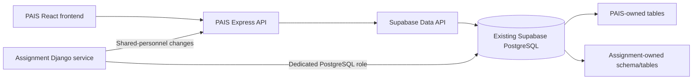

# Shared Database Integration Review and Assignment Project Checklist

**Purpose:** Review the proposed integration between PAIS and the Preferred Assignment Location Survey & Admin Dashboard, then give the Assignment project team a concrete checklist for sharing PAIS's Supabase PostgreSQL database.

**Status:** Planning guidance only. The Assignment project's source code, deployed schema, migration state, and production database were not inspected for this review. Do not run a production migration from this document alone.

## Executive review

The integration guide has sound general advice: choose an owner for each data domain, use stable identity mappings, rehearse migrations in staging, reconcile data, and prepare cutover and rollback steps.

It is not yet an implementation runbook for this repository. The guide describes a Django application, while PAIS here is a React/Vite frontend with an Express backend that accesses Supabase. The guide's Django source references and the Assignment project's schema claims must be checked against that project's actual source and deployment before implementation.

PAIS already uses Supabase. Its backend connects through the Supabase JavaScript client, and the configuration prefers `SUPABASE_SERVICE_ROLE_KEY` when set. Keep that key server-side and do not give it to the Assignment project. Supabase documents that service-role credentials bypass row-level security (RLS). The Assignment project should have its own restricted database access.

## Recommended architecture

Assumption: the existing PAIS Supabase project is the target database, and the Assignment application remains a separate Django service.

- Keep PAIS's existing tables and Supabase API connection in place.
- Put the Assignment project's tables, Django migration history, and Django auth/operational tables in an isolated schema such as `survey`, or use a reviewed table-prefix approach if its Django configuration cannot safely isolate schemas.
- Give the Assignment runtime a separate PostgreSQL login with only the access its work requires. Use a distinct migration credential for schema changes.
- Let each project own its own tables. For shared personnel, offices, or current assignments, agree on one canonical owner and provide read access through a view/API. Route writes to the owning project's validated service.
- Keep Django's `auth_user` and related tables separate from Supabase Auth's `auth.users`. Decide separately whether users need SSO or a reviewed identity crosswalk.

Supabase's connection guide describes direct connections for persistent backends and migrations, and session-pooler connections as an option for IPv4-only environments. Select the connection mode based on the Assignment host's network and runtime. If a custom schema is accessed through the Supabase Data API, configure that schema explicitly.

## Checklist for the Assignment project team

Legend: **[Assignment]** Assignment project owner; **[PAIS]** PAIS owner; **[Joint]** both owners.

### 1. Confirm scope and current state

- [ ] **[Joint]** Confirm the exact Assignment application, repository, deployment, technical owner, and production revision.
- [ ] **[Assignment]** Confirm the actual framework/runtime, database engine/version, current connection mode, and hosting network requirements. Verify whether the project really uses Django and PostgreSQL as described in the handoff guide.
- [ ] **[Assignment]** Supply the current ERD/DDL, Django models and migrations, applied migration list, table/row counts, constraints, indexes, and required PostgreSQL extensions.
- [ ] **[PAIS]** Confirm the target Supabase project, live PAIS schema, database version, RLS state, grants, and backup/restore process.
- [ ] **[Joint]** Decide whether the work is a one-time consolidation or two live applications using one database. Record the target database and the source of truth for each domain.
- [ ] **[Joint]** Confirm data access, privacy, retention, and personnel-data sharing requirements before copying production data.

### 2. Agree on identity and domain ownership

- [ ] **[Joint]** Name one system as the authoritative writer for personnel identity, current assignment, and office/unit reference data.
- [ ] **[Joint]** Decide which project owns survey eligibility, survey cycles, responses, correction history, transfer planning, and transfer implementation.
- [ ] **[Joint]** If a survey transfer changes PAIS's official assignment, define the PAIS API or shared service that validates and records that change. Do not let both applications directly update the same assignment fields.
- [ ] **[Assignment]** Document how survey `PersonnelRecord`, dashboard roster records, and transfer records map to PAIS personnel and assignments.
- [ ] **[Joint]** Create a reviewed crosswalk with source system, source ID, canonical PAIS ID, match method, review status, and reviewer. Never infer a match from equal numeric primary keys.
- [ ] **[Joint]** Define badge normalization and reuse rules; preserve leading zeros and exact values needed by survey verification.
- [ ] **[Joint]** Document office aliases and parent/subunit mappings. Quarantine ambiguous people and offices for review rather than guessing.
- [ ] **[Joint]** Decide whether each project needs the other's login accounts. Keep account/role mapping separate from personnel identity; do not merge Django and Supabase auth tables.

### 3. Design schema and database access

- [ ] **[Joint]** Preserve PAIS's existing production tables and names unless an explicit, reviewed migration changes them.
- [ ] **[Assignment]** Configure an isolated schema for Assignment-owned tables, including `django_migrations`, `auth_*`, session, admin, and cache tables where used. Verify the effective schema/search path for both migrations and runtime queries.
- [ ] **[Assignment]** If schema isolation is not supported safely by the current Django configuration, propose a reviewed alternative using unique table names and migration tracking. Do not run migrations against PAIS's existing schema without a collision review.
- [ ] **[PAIS]** Inventory all tables and policies the PAIS backend can access through its current Supabase service-role credential.
- [ ] **[Joint]** Create a dedicated Assignment database role. Grant only required access to Assignment-owned tables and approved read-only shared views/tables.
- [ ] **[Assignment]** Use separate runtime and migration credentials. The runtime role should not own schemas or create/alter tables.
- [ ] **[Joint]** Keep the PAIS service-role key out of the Assignment project, browser code, logs, migration files, and shared documentation.
- [ ] **[Assignment]** Test access as the actual Assignment database role. Do not assume policies based on `auth.uid()` will behave the same in a direct PostgreSQL connection as they do through Supabase Auth.
- [ ] **[Joint]** For every Supabase-exposed table, review both SQL grants and RLS policies. A policy does not revoke a grant, and service-role access bypasses RLS.
- [ ] **[Assignment]** Store the connection string in the deployment secret manager, require TLS, and select direct/session-pooler access to match the hosting network and connection lifecycle.
- [ ] **[Joint]** If a custom schema must be accessed through the Supabase Data API, add it to the exposed-schema configuration, grant only necessary privileges, and explicitly select that schema in clients.

### 4. Prepare and rehearse data migration

- [ ] **[PAIS]** Take a consistent backup of PAIS and restore it into an isolated staging Supabase project.
- [ ] **[Assignment]** Back up the Assignment database and verify a restore into an isolated staging environment.
- [ ] **[Joint]** Record extraction cutoffs, row counts, table checksums where practical, and the final-delta plan.
- [ ] **[Assignment]** Create a repeatable loader that preserves source IDs, source values, timestamps, JSON data, audit history, and import provenance.
- [ ] **[Assignment]** Stage source rows and crosswalk mappings before inserting into live domain tables.
- [ ] **[Joint]** Produce and resolve conflict reports for duplicate/reused badges, ambiguous NUP names, assignment disagreements, office aliases, missing required values, receipt conflicts, and historical rows without a cycle.
- [ ] **[Assignment]** Load data in foreign-key dependency order and preserve existing survey and transfer history. Do not execute historical transfer workflows as a way to copy their effects.
- [ ] **[Assignment]** If explicit primary keys are imported, reset PostgreSQL identity sequences and verify the next inserts cannot collide.
- [ ] **[Joint]** Do not dual-write the same fields from both systems during migration. Choose a temporary writer and define how the final delta is captured.

### 5. Validate staging and approve cutover

- [ ] **[Joint]** Reconcile source and target counts by table, status, category, office, cycle, and active/eligible population.
- [ ] **[Assignment]** Verify foreign keys, unique constraints, Django migration state, sequence values, and absence of orphaned records.
- [ ] **[Joint]** Verify that Assignment users can access only the intended schema/tables and cannot alter PAIS-owned data directly.
- [ ] **[Joint]** Verify PAIS can continue its existing workflows after Assignment tables are added.
- [ ] **[Assignment]** Exercise the survey lifecycle, controlled edits, history retention, exports, and transfer workflow against staging data.
- [ ] **[Joint]** Verify shared-personnel reads, rejected unauthorized writes, retries, concurrent changes, and audit attribution.
- [ ] **[Joint]** Rehearse backup restoration and the rollback procedure. Agree on the acceptable data-loss window and recovery time.
- [ ] **[Joint]** Approve a written reconciliation report, cutover window, final-delta approach, deployment order, and rollback owner before production changes.

### 6. Cut over and operate

- [ ] **[Joint]** Freeze writes or run the approved final-delta process; reconcile again immediately before cutover.
- [ ] **[Assignment]** Deploy the Assignment service with its dedicated database credentials and verified connection mode.
- [ ] **[PAIS]** Keep PAIS on its existing Supabase API configuration unless a separate, reviewed PAIS change is approved.
- [ ] **[Joint]** Run health checks and workflow smoke checks, then reopen writes after both owners accept the reconciliation results.
- [ ] **[Joint]** Monitor database connections, query failures, permission denials, latency, and integration conflicts.
- [ ] **[Joint]** Define an ongoing change interface: PAIS API or a durable event/outbox feed, with source event IDs, idempotent retries, reconciliation, and an assigned conflict resolver.
- [ ] **[Joint]** Retain original backups and application configurations until the agreed rollback window closes.

## Required Assignment-team deliverables

- [ ] Verified schema inventory and migration graph from the deployed Assignment project.
- [ ] Approved field-ownership and identity-mapping worksheet.
- [ ] Schema isolation and role/grant/RLS design reviewed by both project owners.
- [ ] Repeatable staging migration/loader and conflict report.
- [ ] Staging reconciliation report and restore evidence.
- [ ] Production cutover and rollback runbook.
- [ ] Ongoing shared-data API/event contract and operational owner.

## Review references

- [External system integration guide](../../EXTERNAL_SYSTEM_DATABASE_INTEGRATION.md) — current handoff guide; its Assignment-project claims need verification against that project's source and deployment.
- [PAIS README](../../README.md) — describes this repository's React/Vite and Express/Supabase stack.
- [PAIS Supabase client configuration](../../backend/config/supabase.js) — shows server-side Supabase client setup and service-role preference.
- [Supabase PostgreSQL connection guide](https://supabase.com/docs/guides/database/connecting-to-postgres) — connection modes and host/network considerations.
- [Supabase RLS guide](https://supabase.com/docs/guides/database/postgres/row-level-security) — grants, policies, and service-role behavior.
- [Supabase custom-schema API guidance](https://supabase.com/docs/guides/troubleshooting/postgrest-not-recognizing-objects-in-schema) — schema exposure and explicit schema selection for Data API clients.
